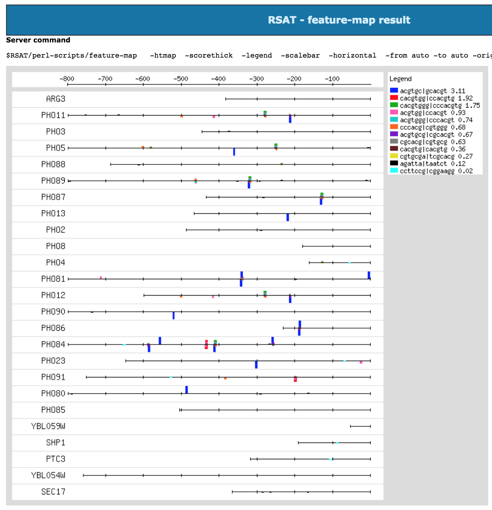

```{r setup, include=FALSE}
library(knitr, warn.conflicts = FALSE)

knitr::opts_chunk$set(
  echo = TRUE, 
  eval = FALSE, 
  cache = TRUE, 
  message = FALSE, 
  warning = FALSE, 
  comment = "",  
  fig.align = "center",
  fig.width = 7, 
  fig.height = 5,
  out.width = "90%",
  fig.path = "figures/")
```

# Introduction

This document explains how to install and configure the Regulatory Sequence Analysis Tools (RSAT). 

# Downloading RSAT

1. Go to the RSAT portal (**<http:rsat.eu/>**)
2. Select any server. 
3. In the left-sided menu,  click on the **Download** link. 
4. Fill in your name and coordinates and accept the license.


You now have access to the download page containing the links to  

- the latest stable release named `rsat_20XX-XX-XX.tar.gz` (XX-XX-XX must be replaced by the release date).
  
- the previous release archives available in the folder `previous_versions`.
	 
## Downloading the latest RSAT release via the Web installer  

5. Download the tar archive named  

`rsat_20XX-XX-XX.tar.gz`  

where `XX-XX-XX` is the latest release date and put it in your chosen directory.  

6. Uncompress the archive. This will create a directory named `rsat` where we will continue the install procedure.

```{bash}
export RELEASE=20XX-XX-XX
## e.g. export RELEASE=2018-05-26


## By default we install the package a folder named packages. 
## This should be adapted according to your local setup. 
export INSTALL_ROOT=~/packages
mkdir -p ${INSTALL_ROOT}

## Replace XX-XX-XX by the actual release
tar -C ${INSTALL_ROOT}/ -xpvzf rsat_${RELEASE}.tar.gz
cd ${INSTALL_ROOT}/rsat
```

# Configuring your local RSAT instance

We will start by auto-configuring RSAT in order to deine suitable basic parameters. 

## Getting the IP address of your machine

Replace [your.server.IP] by the actual IP address of your server. 
(e.g.: for Virtualbox Virtual Machines, we set the IP to 192.168.56.101). 

```{bash}
## Get your IP address and check if it is 192.168.56.101
ifconfig | grep 'inet '
export MY_IP=XXX.XXX.XXX.XXX
## e.g. export MY_IP=192.168.56.101
```

Note: if you install RSAT on a personal PC (e.g. a laptop) and intend to use it only from this machine, you can configure it with the local network.

```{r}
## Configure RSAT to be used internally inly
export MY_IP=127.0.0.1
```

## Choose a site name for your RSAT instance

You can choose an arbitrary name for your RSAT instance. 
For this tutorial, we will call it "my_rsat".

```{bash}
export RSAT_SITE=my_rsat
```


## Automatic configuration of RSAT parameters

```{bash}

## Check that the IP site of your machine has been specified
echo ${MY_IP}

## Check that you defined a site name for your RSAT instance
echo ${RSAT_SITE}

## Semi-auto configuration for VirtualBox VM
## (adapt IP address if required)
perl perl-scripts/configure_rsat.pl -auto  \
  rsat_site=${RSAT_SITE} \
  rsat_www=http://${MY_IP}/rsat/ \
  rsat_ws=http://${MY_IP}/rsat/ \
  ucsc_tools=1 \
  ensembl_tools=1
```

You can add some additional option, e.g. enter your mail address as server admin, activate some specific tools that are disabled by default. 

```{bash}
rsat_server_admin=your.mail@your.mail.server
variation_tools=1
```

<!--

## For the IFB cloud

RSAT has been ported on the cloud of the [**Institut Français de Bioinformatique**](http://www.france-bioinformatique.fr) (**IFB**). The tools are available as an appliance which enables each user to automatically start an RSAT server, that can be used in a terminal, via a Web interface, or invoked remotely as Web services. 


Since the IP address is allocated dynamically during at the start of the instance booting, we use an automatic configuration. 

```{bash}
perl perl-scripts/configure_rsat.pl -auto  \
  rsat_site=rsatvm-ifb-2018-05 \
  RSAT=${INSTALL_ROOT}/rsat \
  rsat_www=auto \
  rsat_ws=auto \
  phylo_tools=0 \
  compara_tools=0 \
  variations_tools=0 \
  ucsc_tools=0 \
  ensembl_tools=0 \
  SUDO=sudo
  
chmod 755 /root # required for apache user to access the packages
```
-->

## Advanced RSAT configuration

In order to see all options, you can run the script `configure_rsat.pl` without the option `--auto`

```{bash}
perl perl-scripts/configure_rsat.pl
```

You can now refine the configuration by choosing custom parameter to your RSAT instance (for example the email of the local admin, the organism group, ...).


# Installing RSAT

Before running the installation, it might be worth updating the Linux distribution (`apt-get update`) in order to get the latest versions of the basic packages. 

```{bash}
## This requires admin privileges
sudo bash

## Check who you are  (should be root)
whoami

## Define your operating system (currently supported: ubuntu, macosx) by running one (and only one) of the commands below. 
export MY_OS=macosx
export MY_OS=ubuntu


## Go to the RSAT directory
export INSTALL_ROOT=~/packages
cd ${INSTALL_ROOT}/rsat

## Read config and run bash installation scripts
source RSAT_config.bashrc && \ 
bash installer/01_${MY_OS}_packages.bash && \
bash installer/02_python_packages.bash  && \
bash installer/03_install_rsat.bash && \
bash installer/04_perl_packages.bash  && \
bash installer/06_install_organisms.bash && \
bash installer/07_R-and-packages.bash  && \
bash installer/08_apache_config.bash && \
bash installer/09_rsat_ws.bash && \
bash installer/10_clean_unnecessary_files.bash

## Restore rsat as owner of the $RSAT folder
## NOTE: the following command should be adapted to the login and group of the user owing the rsat package.
chown -R rsat.rsat $RSAT

## Exit sudo session
exit

## Check who you are (should be back to normal user identity)
whoami ## This should give 'rsat'
```

# Testing the command lines

The script `makefile/install_tests.mk` runs a series of tests for different components of the *RSAT* suite. Each test result is stored in a separate file in the test directory (`./install_tests` by default). Output file names are printed out after each test. 

```{bash}
## Load the RSAT configuration
source RSAT_config.bashrc

cd $RSAT
make -f makefiles/install_tests.mk all

## Check the results
ls -ltr install_tests
```


# Testing the Web server

The web site can be tested by selecting any supported tool, clicking on the demo button and checking the result. 

We usually use the following tools as diagnostic of the proper functioning of a server. 


1. **Supported organisms** to check if the default organisms have been installed. 

2. **Fetch sequences from UCSC**: 

    - is the list of organisms is correctly displayed (obtained dynamically from UCSC) ?
    - run the demo: do you obtain fasta sequences ?

3. **retrieven Ensembl seq**: 

    - is the list of organisms is correctly displayed (obtained dynamically from Ensembl) ?
    - run the demo 1 (single organism): do you obtain fasta sequences ?
    
4. **convert-matrix**: check that logos are properly generated

5. **gene-info** to **feature-map**: check that the genes are well returned with gene-info, then successively send the results throught the following tools: 

      - **gene-info** demo -> gene list. Check if you obtain a table with genes. If so, under *Next steps*, click the button *retrieve sequences*.
      
      - **retrieve sequences**. Click "Run Analysis" then "GO". In the result, check the fasta file. Next step: *oligo-analysis*. 
      
      - **oligo-analysis**. In the result, check the k-mers (oligos) then the matrices and the logos. In the Next step box, end the result to *string-based pattern matching*. 
      
      - **dna-pattern**
      
      - **feature-map** check that the png figure is properly generated and displayed. 

At the end of this process the results should look like the figure <installer/images/feature-map_web_result.png>



****************************************************************
# Supplementary information

## Files

rsat_YYYY-MM-DD.tar.gz

   Stand-alone versions + web servers for RSAT and NeAT (except the
   metabolic tools).

metabolic-tools_YYYYMMDD.tar.gz

   Metabolic pathway analysis tools (supported on some NeAT servers).

## RSAT/NeAT installation and user guides

After having uncompressed the archive, you will find the installation
and user guides in the `doc/manuals` directory

```{bash}
ls -1 public_html/release/*.pdf
```


| Guide | File |
|------------------------|---------------------------|
| RSAT installation guide |   RSAT_install_guide.pdf |
| RSAT Web configuration guide |   rsat_web_server.pdf |
| RSAT Command-linde user guide |  tutorial_shell_rsat.pdf |
| NeAT Web server configuration |  neat_web_server.pdf |
| NeAT Command-line user guide |   neat_tutorial.pdf |

****************************************************************

