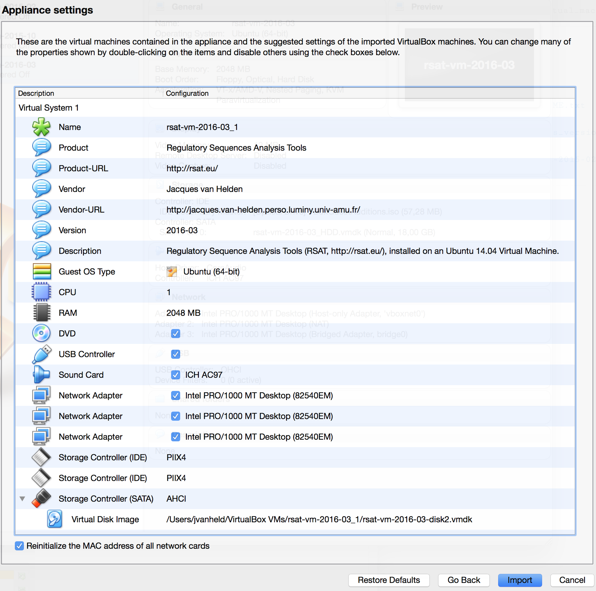
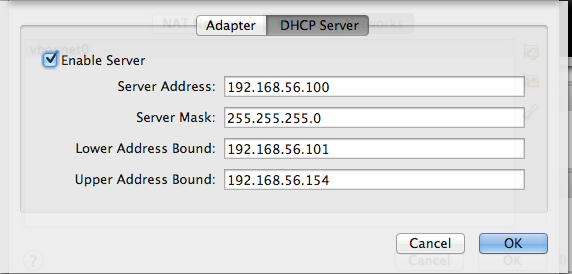
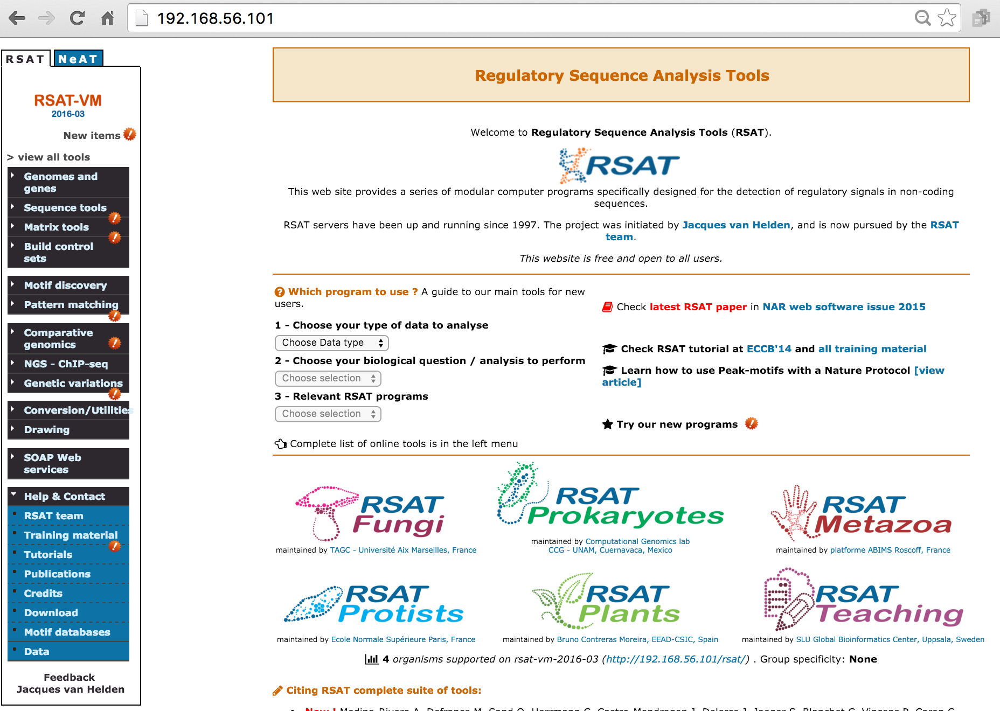
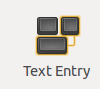

# Introduction

This tutorial explains how to install, configure and use a Regulatory Sequence analysis Tool (RSAT) server installed on a Virtual Machine (VM).

# Prerequisite

To run this tutorial, you first need to install the VirtualBox software (<https://www.virtualbox.org/wiki/Downloads>).


# Importing the Virtual Machine archive (ova file)


## Download

RSAT virtualboxes can be downloaded from the RSAT distribution site. 

- Open a connection to any RSAT server (<http://rsat.eu/>).
- In the left-side menu, click on the **Download** link. 
- Enter your coordinates and click *GO*. You will be redirected towards the download server. 
- In the download Web site, the link *virtual_machines*.
- Download the version of your choice (current version: `rsat-vm-2017-04.ova`). 


## Importing an appliance into VirtualBox

- In the VirtualBox menu, select the command **File > Import Appliance ...**.
- In the import dialog box, click on the folder icon, and locate the appliance file (`rsat-vm-2017-04.ova`) that you downloaded from the RSAT Web site, and click on **Continue**. 
- In the **Appliance settings** dialog box ([snapshot](images/import_appliance_settings.png)), check the option ***Reinitialize MAC address of all network cards***. 
- Click the **Import** button. 

[{width="600"}](images/import_appliance_settings.png)

It should take a few minutes for VirtualBox to create a new instance of the virtual machine from the appliance. 

****************************************************************
# Network configuration

Network configuration involves two aspects: 

1. Configure VirtualBox to define the way(s) it will allow exchanges between virtual machines, the host machine (your computer) and the external world. 

2. Configure each virtual machine, in order to define which types of access it will request from VirtualBox. 

## VirtualBox host-only adapter


1.  Open the **VirtualBox** program.

2.  Open *VirtualBox Preferences*. Click on the *Network* option. Click on the tab *Host-only Networks*. Check if a host-only adapter is already installed. If not, create a new one by clicking the ***+*** icon on the right side ([snapshot](images/vb_prefs_host-only_network.png)).

    [{width="400"}](images/vb_prefs_host-only_network.png)

3.  You should now see a host-only network named vboxnet0. Double-click on it to change its parameters.

4.  In the *Adapter* tab, set the parameters as follows ([snapshot](images/vb_prefs_host-only_adaptor.png)).

    |  Parameter | Value  |
    |---------------------------|--------------|
    | IPv4 Address              | 192.168.56.1 |
    | IPv4 Network Mask         | 255.255.255.0 |
    | IPv6 Address              | (leave this field blank) |
    | IPv5 Nework Mask length   | 0 |

    [{width="400"}](images/vb_prefs_host-only_network.png)

5.  In the tab *DHCP Server*, set the parameters as follows ([snapshot](images/vb_prefs_host-only_dhcp.png)).

    -   Check the option *Enable Server*
    -   Server Address: 192.168.56.100
    -   Server mask: 255.255.255.0
    -   Lower Address Bound: 192.168.56.101
    -   Upper Address Bound: 192.168.56.154

    [{width="400"}](images/vb_prefs_host-only_network.png)

## Network settings for the guest machine

VirtualBox supports various ways to connect the guest (virtual machine) to the network.
We need to open two of them:

1. *Host-only network* will enable the host machine (your computer) to access the virtual machine by HTTP (Web browser) or SSH (secure shell). 

2. *NAT* will enable the communication from the virtual machine to the external world.

### Host-only network

This solution offers a good tradeoff between security and confort: your virtual machine (the guest) will be accessible only from your computer (the host).

In the panel showing the available virtual machines, right-click on the RSAT-VM (rsat-vm-2017-04), open the *Settings ...* dialog box. In the tab *Network*, select *Adapter 1*, check *Enable Network Adapter*, select *Attached to: Host-only Adapter* ([snapshot](images/vm_settings_network_host-only.png)).

In the pop-up menu besides the option *Name*, select *vboxnet0*. [{width="400"}](images/vm_settings_network_host-only.png)

### NAT

**Note:** the host-only adapter will enable you to establish a connection (Web browsing, ssh connection) from the hosting operating system (the usual environment of your computer) to the guest system (the virtual machine). however, this adapter does not allow to connect the external world from the guest. It is this useful to combine the host-only network (to see your server from your host) and the NAT network (to see the external world from your RSAT VM).

In parallel to the host-only adapter, we thus recommend to enable the second adapter and select *NAT* ([snapshot](images/vm_settings_network_nat.png))..

[{width="400"}](images/vm_settings_network_nat.png)

### Bridged network

Alternatively , for the sake of flexibility, you might consider to use a bridged network. The bridged adapter is the most convenient, because it establishes a bidirectional connection between your VM (the guest) and the network. Your guest RSAT Web server can thus be used from any other computer in your network. This configuration can typically be usd to make an RSAT server available for all people from the same lab or institute.

**Attention!** The bridged network makes your virtual machine visible for all the other computers of the local network the host machine (your PC). Check with your system administrator that this fits the local security requirements.

- In the panel showing the available virtual machines, right-click on the RSAT-VM (rsat-vm-2017-04), open the *Settings ...* dialog box.

- In the tab *Network*, select *Adapter 1*, check *Enable Network Adapter*, select *Attached to: Bridge adapter*. 

- In the pop-up menu besides the option *Name*, select an adapter depending on your local network configuration, e.g.
*Wi-fi (Airport)* ([snapshot](images/vm_settings_network_bridged.png)).

[{width="400"}](images/vm_settings_network_bridged.png)


****************************************************************
# Running RSAT-VM


## Starting the RSAT virtual machine

In the left panel of **VirtualBox**, select the virual machine (rsat-vm-2017-04), and click on the *Start* icon.

This will open a new window  ([snapshot](images/rsat-vm_login_window.png)).

[{width="600"}](images/rsat-vm_login_window.png)

From now on, your RSAT Virtual Machine is up and running. You can access it in various ways: 

1. As a Web server
2. As a fully functional Linux Desktop server
3. On the command line
4. As SOAP/WSDL Web services (advanced use). 

## Using RSAT-VM as Web server

Open a connection to **<http://192.168.56.101/>** in your web browser. 

Note: this IP address is assigned dynamically by VirtualBox. If you already have one or more virtual machines, the last number may take a higher value (e.g. <http://192.168.56.102>, <http://192.168.56.103/>).


[{width="600"}](images/rsat-vm_web_site.png)

## As a fully functional Linux Desktop server

You can also use the VirtualBox virtual machine through the Linux Desktop server interface. For this you need to login as either `vmuser` (normal user of the RSAT suite) or `rsat` user (administration of the tools, genome installations, ...). 

### RSAT-VM log-in

The RSAT VM has two predefined users: 

- **RSAT admin**, the owner of the RSAT folder (/packages/rsat). Log in with this account when you need to manage the RSAT installation (modify the code, install additional genomes, ...).

    - Username: rsat
    - Iniitial password: tochng

- **RSAT VM user**, not owner of the RSAT folder. Log in with this account for normal use of the virtual machine (including RSAT suite). 

    - Username: vmuser
    - Initial password: tochng

We intently chose an overly simple temporary password to ensure compatibility with AZERTY as well as QUERTY keyboards, but  you will be forced to **change your password at first login**.  It is important to choose a suitable non-trivial password, to prevent hackers from accessing your virtual machine. 

Both rsat and vmuser are sudoers. After login, you thus become the master of your Virtual Machine, which allows you to create new users, install packages, etc.

### Chosing the adequate keyboard for your computer

A small difficulty when distributing a VM is the large variety of keybords expected to be found on the users' computers. By default, we selected the standard British QWERTY keyboard.


On the desktop version, click on the *Settings* icon [{width="40"}](images/icon_settings.png),
then on the [{width="50"}, and check the keyboard.](images/text-entry_options.png).

On Ubuntu server version, keybord configuration can be modified with following command.

```
sudo dpkg-reconfigure console-data
```

## Connecting the RSAT instance from your system's terminal

If you are familiar with the Unix command line environment, you can access your virtual machine from a terminal of the host machine, with the following commands. 

- To log in as normal user: 

```
ssh vmuser@192.168.56.101
```

**Note:** the initial password has been set to `tochng`. At your first login you will be forced to change this password. After having reset your password, you will be brought back to the terminal of your computer, and you need to re-type the ssh command in order to actually log in. 

- To log in as RSAT administrator (e.g. to manage genomes):

```
ssh rsat@192.168.56.101
```

****************************************************************
