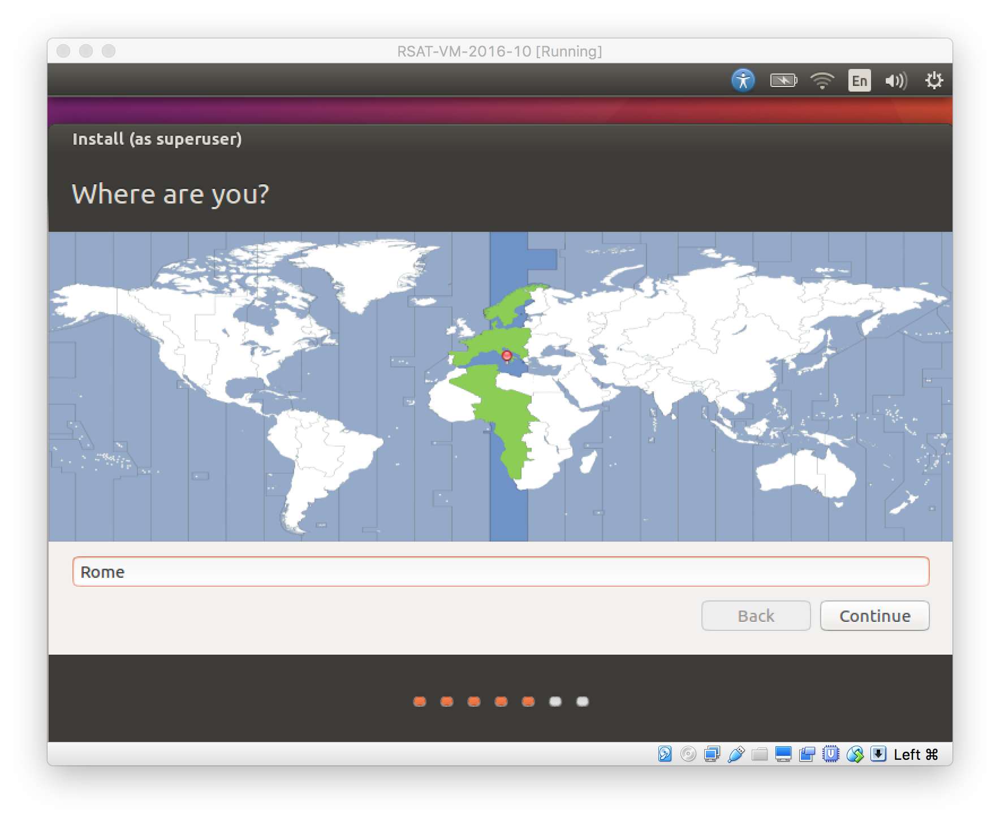
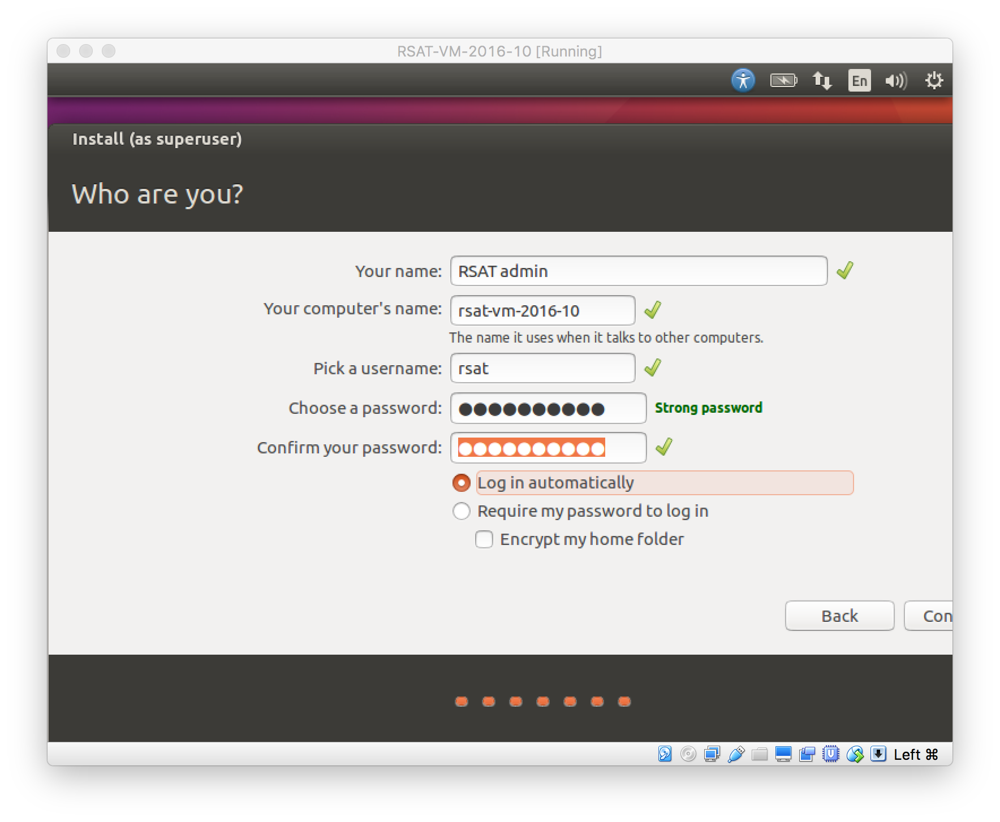
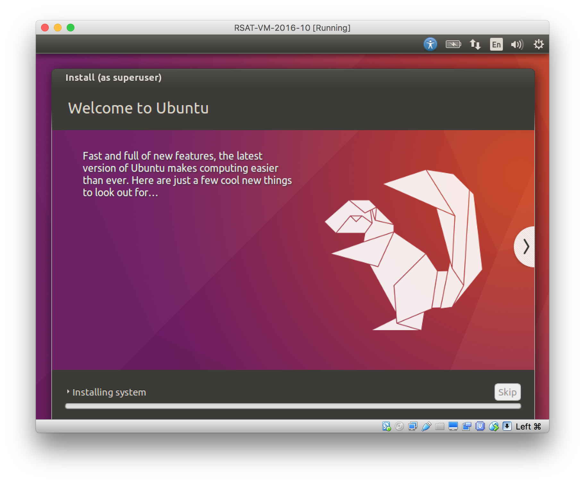

# To do

1. Create a separate virtual disk for the data, and explain how to mount it on the virtual machine.

****************************************************************
# Requirements


## Downloads

Before starting the installation process, we recommend to download the following files

Virtualbox:  <https://www.virtualbox.org/wiki/Downloads>

Ubuntu Desktop Version 17.04: <https://www.ubuntu.com/download/desktop>

Lighter alternative (without graphical Ubuntu interface): Ubuntu Server Version 17.04: <https://www.ubuntu.com/download/server>

<!--- Version 14.04.5 <http://releases.ubuntu.com/14.04/ubuntu-14.04.5-desktop-amd64.iso>-->

****************************************************************
# Installation of the virtual machine

## Creating a new virtual machine

1. Open VirtualBox

2. Click on the **New** button. 

3. Parameters

- Name and operating system

    - Name: RSAT-VM-2017-04
    - Type: Linux
    - Version: Ubuntu (64 bits)

- Memory size:	2048 Mb (this can be modified afterwards). 

- Hard drive:	*Create a virtual hard drive now*. 

- Hard drive file type: *VMDK* (Virtual Machine Disk). 

    I chose this option because it ensures a wider compatibility with other OS and Virtual Machine management systems. 

	   Another potential advantage of VMDK is that it enables to split virtual disks into files <=2Gb, which is convenient to store them on FAT partitions. However, for the distribution I avoid to activate this option because it is simpler to put a single dwnloable file on the server. 

- Storage on physical hard drive
    - Select *Dynamically allocated*
    - Depending on your storage device, you may activate the option *Split into files less than 2Gb*, which allows to store the VM on FAT partitions for Windows host machines.


- File location and size

    - name of virtual hard drive file:    RSAT-VM-2017-04_HDD
    - max size of virtual hard drive:	    18GB

        **Beware:** the size has to be larger than you real needs, because Ubuntu will automatically create some big  partitions (/dev and /run/shm). Since we allow dynamical memory allocation, it is fine to set the max size to 18Gb, which will be grossly assigned as follows:

        - max 14Gb for the root partition /
        - 2Gb for /dev
	      - 2Gb for /run/user


At this stage, the VM has been created and needs to be configured before installing the operating system. 


****************************************************************
## General configuration of the network for your VirtualBox program

Before configuring the virtual machine, we need to tell VirtualBox how it will enable your local virtual machines to interact with their host (the operating system of the machine on which the VM is running).

1. Open **VirtualBox Preferences**

2. Open the tab *Network* > *Host-only Networks*

     - Click on the "+" icon.
     - This creates a network vboxnet0. 
     - Select this network, click on the screw driver icon (*edit host-only network*), and set the following options:

      - *Adapter* tab
          - IPv4 Address: 192.168.56.1
          - IPv4 Network Mask: 255.255.255.0
          - IPv6 Adress: blank
          - IPv6 Network Mask Length: 0

      - *DHCP Server* tab
          - Check *Enable Server*
          - *Server Address:* 192.168.56.100
          - *Server Mask:* 255.255.255.0
          - *Lower Address Bound:* 192.168.56.101
          - *Upper Address Bound:* 192.168.56.254

## Network configuration of the virtual machine

- In the VirtualBox main window, select the newly created virtual machine. 
- Click on the **Settings** button. 
- In the VM settings, select tne *Network* tab. 

VirtualBox enables you to specify several adapters, each corresponding to one separate network acces (e.g. using an ethernet card + wi-fi connection). Note that you will have the possibility to modify the network settings later.

VirtualBox offers alternative ways to configure network communications between the virtual machine, the host machine, and the external network. To get more information about network settings: 

- VirtualBox manual page: <https://www.virtualbox.org/manual/ch06.html>
- An excellent tutorial: <http://christophermaier.name/blog/2010/09/01/host-only-networking-with-virtualbox>
    
We present here one possible way to configure your Virtual machine, but this should be adapted to the particular security/flexibility requirements of the network where the maching has to run. 


### Adapter 1: Host-only adapter

The first network adapter is the safest: the only possible communication is from the host to the guest. This is sufficient to enable you to use the RSAT VM from your computer and only from there. Besides, your VM has no possibility to establish a connection to the external work. 

- click on the tab *Adapter 1*,
- check *Enable Network Adapter*
- Attached to: *Host-only Adapter*
- Name: *vboxnet0* (this network must have been created beforehand)

### Adapter 2: NAT


We strongly recommend to specify a NAT as second adaptor, since this allows your VM to establish connections (browser, ssh) to the world outside the host machine (your computer). 

- click on the tab *Adapter 2*,
- check *Enable Network Adapter*
- Attached to: *NAT*


### Additional networks (optional)

**BEWARE!** If you activate the adaptor described below your VM will be visible from external computers in the same network as the host  machine.

See information at: <https://www.virtualbox.org/manual/ch06.html#network_bridged>

- click on the tab *Adapter 3*,
- check *Enable Network Adapter*
- Attached to : *Bridged Adapter*
- Name: choose an option corresponding to the actual internet connection of the host machine (e.g. ethernet cable, Wi-Fi, ...).

**Note:** you can also activate a fourth adapter, for example to support both an ethernet card (Adapter 3) and a Wi-Fi connection (Adapter 4). This is particularly useful for laptop computers, whose network parameters vary from place to place. 

****************************************************************

## Starting the server for installation

- Once the settings have been specified, you can click on the **Start** icon (big fluo green array in VurtualBox).

- A dialog box may appear *"Please select a virtual optic disk ..."*. Click on the small folder icon and locate the disk image of Ubuntu that was downloaded in a previous step. Then click the **Start** button. 

Ubuntu is now starting from the installation disk. The next section explains how to configure it. 

****************************************************************

# Linux operating system installation

## Ubuntu desktop version

The desktop version of Ubuntu presents the advantage of letting users work directly in the graphical environment of the Ubuntu virtual machine, which is convenient to open non-text result files for visualization (web pages, images) and to analyze the results in other graphical packages (R, openOffice, CytoScape, ...).


- Start the default installation: Click the button: **Install Ubuntu**


- Dialog box **Preparing to install Ubuntu**. 

    - Make sure the option *Download updates while installing Ubuntu* is unchecked (we will update the packages after installation). 
    - Leave the other parameters unchanged and click **Continue**.
    


- **Installation type**: 

    - Check *Erase disk and install Ubuntu*
    - Uncheck *Encrypt new Ubuntu installation for security* 
    - Leave all other options unchanged. 
    - Click **Install Now**. 
    - There will be a warning message **Write the changes to disk?**. Click **Continue**. 


In the dialog box **Write the changes to disk?** click **Continue**. 


- **Where are you?**

    If you VM has a suitable Internet connexion, your location should be detected automatically. If not, choose the right location.



- **Keyboard layout**: make your choice^[I have a *French - French Macintosh*, so I use it for installation, but I will later add an English keybord for the distribution.]


**NOTE CLAVIER FRANÇAIS**: for the French Macintosh keyboard, I spent a lot of time to find the solution to use the 3-component keys
(e.g. alt-shit-L for the pipe character |). The simplest solution: use the **alt key on the RIGHT side of the space bar**.

- **Who are you?**

| Field | Value |
|--------------------------------------|-------------------------------------------------------|
| Your name |	RSAT admin |
| Your computer's name | rsat-vb-2017-04 |
| Pick a username | rsat |
| Password | rsat1704^[This password is obviously not safe, but it will be changed at the end of the installation] |
| Log in automatically | I activate it because this will greatly facilitate the use of the Destkop version |
| | Click **Continue** |



Ubuntu now installs the system, this should take a few minutes^[**Note** if you did  activate the option to update Ubuntu packages in the previous window, the installation can take several minutes].




- After installation, Ubuntu  displays a message *"Installation is complete. You need to restart ..."*. Click **Restart now**. 

- When rebooting, Ubuntu warns you that you need to remove the installation media and close the tray. In our case, the installation media is the iso disk. To remove it, go in the menu **Devices** -> **Optical Drives** -> **Remove Disk from Optical Drive**. If this does not work, close the window with the virtual machine, and restart this virtual machine from VirtualBox. 

- After reboot, you will automatically log in as *RSAT admin* user. 

- For the sake of convenience, I disactivate the lock screen and password prompt options. Indeed, since the VM is running under my account on the hosting system, there is no need to double the security options. For this, click on the **Settings** icon (toothed wheels) on the top-right corner of the Ubuntu display. Select **All Settings** and click on the panell **Brightness and Lock**. Set **Lock** to *off* and uncheck **Require my password when waking from suspend**. 


###  Screen resolution (for Desktop version 14.04)

**Note:** If you are using Ubuntu version 17.04 you can skip this section which was useful to fix a problem with version 14.04. 

With Ubuntu 14.05, at your first log in, the screen resolution is restricted to 640x480 pixels.


I found a solution to increase the screen resolution  here: <http://www.juanrubio.me/2014/02/ubuntu-trusty-virtualbox-guest-additions/>

- Open a terminal and run the following commands: 

```
sudo apt-get install virtualbox-guest-utils
sudo apt-get install virtualbox-guest-dkms
```


<!--
## In version 14.04 I just had this. I should check if the ifconfigapt-get is still requried (it was somehat cumbersome)
# sudo apt-get install virtualbox-guest-dkms
# sudo ifconfigapt-get install virtualbox-guest-additions-iso
software-properties-gtk --open-tab=4
```

In the dialog box, 

- check the option **Using x86 Virtualization ...**
- click **Apply changes** 
- click **Close**
-->


- You need to **restart** the Virtual machine for the changes to apply. 

- After rebooting, the VM has a resizable screen: if you increase the VM window, the Ubunutu desktop will adapt its size accordingly.

****************************************************************
## Ubuntu Server version (still for version 14.04, to be checked and adapted for 16.04)

The server version is less comfortable than the desktop version, but
it should be more economic in terms of hard drive (and CPU/RAM for
graphical resources ?).

Language  English

Home page: choose "Install Ubuntu Server"

Language (again): English

Country, territory or area: other > Europe > France

Country to base the default locale setting: United Kingdom 
	(there is apparently no setting for France !)

Detect keyboard layout: No > French > French - French (Macintosh)

Your system has multiple network interfaces (I guess this corresponds
tothe 3 adapters specified in VirtualBox preferences).
      Primary network interface: eth0

host name: rsat-vb-ub14s

Full name of new user:	RSAT admin

Username for your account: rsat

Password for new user: the classical (only for RSAT team members)

Encrypt home directory ? No

Time: Europe/Paris

Partitioning method: (default) Guided - use entire disk and set up LVM

     Next partitioning options: I say "continue" to all with default values

 ... Installing the sysem ... (takes some time)

Configure the package manager
	  Leave the HTTP proxy blank
  -> ... configuring apt (takes some time)

Configuration taskse1

   Install security updates automatically

Software selection : I just install the OpenSSH server, in order to be
able connecting, but I don't install anything else since I want to use
the RSAT bash file with apt-get packages etc.
    -> ... Select and install software (takes some time)

Install the GRUB boot loader
	Yes


****************************************************************
## Convenient settings (not necessary)

### Clipboard sharing between guest and host

For the desktop version of Ubuntu, it is convenient to enable copy-paste between the guest and the host.

- select the VM
- In the VirtualBox menu, select **Machine -> Settings**
- In panel "General", select the tab **Advanced**, and set **Shared clipboard** to **Bidirectional**.
- Optionnally, you can also set the **Drag-n Drop** option to **Bidirectional**. 


****************************************************************
## Remote log in to the VM

So far the virtual machine does not support remote access.
To add support for `ssh` access, we need to install the appropriate package. 

- In the virtual machine, open a terminal and type the following command. 

```
sudo apt-get install --quiet --assume-yes ssh
sudo apt-get install --quiet --assume-yes net-tools
```

The package `net-tools` includes the `ifconfig` command, which will be useful to get the IP addresses of your VM. 

- From the ***host*** machine, open a terminal and type the following command. 

```
ssh rsat@192.168.56.101
```

**Note**: the IP address above may be different on your computer, depending on the network settings of your VirtualBox and on the number of Virtual Machines currently running. 

You are now connected to your virtual machine via an ssh session from the host machine.


At this stage, the machine is able to boot and get a dynamic IP from
the network. I login as rsat user and type


```
ifconfig
```

to get the IP address. I then open a terminal on the host machine, and run

```
ssh rsat@[IP_OF_MY_VM]
```

so I can run the rest of the installation in my familiar environment
(terminal, keyboard, ...)


****************************************************************
## Useful commands to manage VirtualBox

It is useful to install some VirtualBox accompanying software on your Ubuntu virtual machine. 

```
sudo apt-get install virtualbox
sudo apt-get install virtualbox-dkms
```

### List running VMs

```
VBoxManage list runningvms
```

### Get IDs of the virtual machines

```
VBoxManage list runningvms | awk -F"[{}]" '{print $2}'
```

For convenience, we store the IP of the machine of interest in an
environment variable VMID.
  VMID=`VBoxManage list runningvms | awk -F"[{}]" '{print $2}'`

Get properties of the VM

```
VBoxManage guestproperty enumerate ${VMID}
```

List information about a given virtual machine

```
VBoxManage showvminfo ${VMID}
```

Note: that command returns the MAC address, but no IP address.

```
VBoxManage showvminfo ${VMID} | grep '^NIC'
```


****************************************************************
## Create a generic user for the virtual machine


We create two separate users: 

- vmuser is a simple user of RSAT, has no right to administrate it (e.g. add new genomes, ...)
- rsat is the administrator for the Web site. 

Both users (vmuser and rsat) have an initial password provided with the distribution (***tochng***), but which must be changed at the first login.


```
################################################################
## Create a user for the virtual machine
##
## This VM user is separate from the rsat user, which only serves to
## manage the RSAT software suite and related packages.
##
## For the sake of security, we force this user to change password at
## first login

## First delete this user (in case it was previously defined)
##  sudo userdel --remove vmuser

sudo useradd --password `openssl passwd -1 -salt xyz tochng`\
    --home /home/vmuser \
    --create-home \
    --shell /bin/bash \
    --comment "VM user" \
    vmuser

## Force vmuser to change password at first login
sudo chage -d 0 vmuser

## Force rsat user to change password at first login
sudo usermod --password `openssl passwd -1 -salt xyz tochng` rsat
sudo chage -d 0 rsat

## Add sudoer rights to vmuser and rsat users
sudo chmod 644 /etc/sudoers
sudo nano /etc/sudoers
## Find the following line
##     # User privilege specification
##     root    ALL=(ALL:ALL) ALL
## Below it, add the following line:
##     rsat    ALL=(ALL:ALL) ALL
##     vmuser  ALL=(ALL:ALL) ALL
## Type "Ctrl-X" to exit from the nano editor, then "Y" to save your changes. 
```

****************************************************************
## Install Ubuntu packages and RSAT distribution


The instructions to install Ubuntu packages are in a separate file

[$RSAT/doc/howto/install_rsat_ubuntu16.bash](install_rsat_ubuntu16.bash)


****************************************************************
## PROBLEMS TO BE FIXED


1. Ethernet: optimize solution for a simple setting in the classroom.

2. Problem of disk occupancy: Ubuntu shared memory occupies 2Gb. This can be modified as explained here.

    <http://www.cyberciti.biz/tips/what-is-devshm-and-its-practical-usage.html>

4. For the desktop version, I should try to use the **Advanced installation** in order to use less disk without loosing too much confort. For example, I could inactivate the support for all the    languages that are installed by default (downloading language packs).


****************************************************************
## Customizing your instance of the VM

```
## Set up time zone, date and time (source:
## https://help.ubuntu.com/community/UbuntuTime).
sudo dpkg-reconfigure tzdata
```

****************************************************************
### To set up the keyboard (may vary between users who download the VirtualBox VM)

```
sudo apt-get install console-data
sudo dpkg-reconfigure console-data
## (for my laptop, mac / Unknown / French /Standard / New)
```

****************************************************************
## For the Virtualbox VM: mount the virtual disk rsat_data


****************************************************************
# Export appliance


Once the Virtual Machine is working fine, it can be exported to an
appliance.

- In VirtualBox, open "File -> Export Appliance ...", and select the VM.

    - Save as: rsat-vm-2017-04.ova
    - Files of Type: Open Virtualization Format Archive (.ova)
    - Storage Settings
    - Format: OVF 1.0
	  - Check this option:   v Write Manifest File


## Appliance Settings


| Parameter    |    Value                                        |
|:-------------|:------------------------------------------------|
|  Name  		  | rsat-vm-2017-04 |
|	Product		  | Regulatory Sequences Analysis Tools |
|	Product-URL	| http://rsat.eu/ |
|	Vendor		  | Jacques van Helden |
|	Vendor URL	| http://jacques.van-helden.perso.luminy.univ-amu.fr/ |
|	Version		  | 2017-04 |
|	Description	| Regulatory Sequence Analysis Tools (RSAT, http://rsat.eu/), installed on an Ubuntu 14.04 Virtual Machine. |
|	License	    |	Free of use for academic users, non-commercial and non-military usage. |
| | |


****************************************************************
## Transfer Appliance to USB key

Prepare the VM + accompanying material on a USB key, to ensure distribution in the teaching room. We use ScanDisk 64Gb USB3.0 keys, which have a high transfer rate (190Mbps write / 250Mbps read).

```
SOURCE_DIR=/no_backup/VirtualBox_VMs/appliances
VERSION=2017-04

## Specification of the target location
KEY_NB=02
TARGET_DIR=/Volumes/RSAT-VM_${KEY_NB}/
time rsync -ruptvl ${SOURCE_DIR} ${TARGET_DIR}
```

### Split the VM into smaller files (optional)

This can be useful for two purposes.

1) To transfer files to a FAT-formatted drive for distribution (FAT cannot hold files >4Gb). Note that the final installation drive will have to support files >4Gb for the server version of the VM.
2) To facilitate synchronization between local and remote machines.

```
SPLIT_SIZE=3999m
mkdir -p ${TARGET_DIR}/appliances
time split -b ${SPLIT_SIZE} ${SOURCE_DIR}/rsat-vm-2017-04_${VERSION}.ova ${TARGET_DIR}/appliances/rsat-vm-2017-04_${VERSION}.ova.split${SPLIT_SIZE}_
```

****************************************************************
## Centos 6.8

I downloaded the install disk from here: 

<http://centos.mirrors.ovh.net/ftp.centos.org/6.8/isos/x86_64/CentOS-6.8-x86_64-LiveCD.iso>

Installation steps:

- Install
- Skip media testing
- Language: English
- Keyboard: fr-pc
- Installation media: Local CD/DVD

