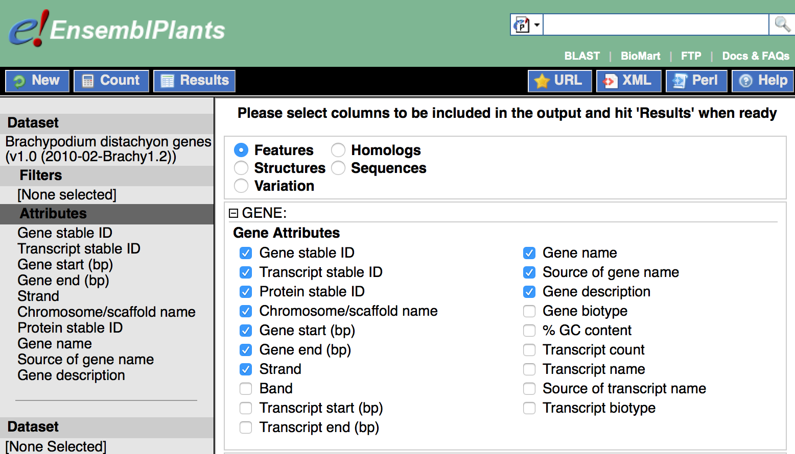

# Downloading plant genomes from Biomart

1. Open a connection to the ensemblgenome server of interest (e.g. [http://plants.ensembl.org/](http://plants.ensembl.org/)).
2. In the top of the page, click the **Biomart** link. 
3. **Choose database** -> *Plant Mart*.
4. **Choose dataset** -> select the species of interest (e.g. Brachypodium). 
5. In the menu on the leftg side, click **Attributes**. 

## Download gene coordinates

0. Create a folder for the genome of interest (for instance biomart_genomes/Brachypodium_distachyon).

1. Select the gene attributes as in the screenshot below. 

2. Before downloading the data, it might be wise to click **Count** in order to check if the number of features is consistent with your knwoledge of the genome of interest. 

3. Click **Results** to generate the feature table. Check the preview. 

4. Select **Export all results** to *File* in *TSV* format (tab-separated values). 

5. Think twice to decide whether you need or not **unique results**. 

6. Click **GO**. 

7. Save the result in the genome directory created above, and name the file *gene.tsv*.

## Formatting tables for RSAT

    export ORG=Brachypodium_distachyon_v1.0
    mkdir -p ${RSAT}/public_html/data/genomes/${ORG}/biomart_genome
    
    perl -F\t -lane 'if ($F[7] == "") {$F[7] = $F[0]}; if ($F[4]== 1) {$F[4]="D"} else {$F[4]="R"}; \
      print join("\t", @F[0,5,2,3,4,7,9])' \
      biomart_genomes/Brachypodium_distachyon/gene.tsv \
      > ${RSAT}/public_html/data/genomes/${ORG}/biomart_genome/gene.tab

#      print join("\t", @F[0,5,2,3,4,7,9])' \
