# Introduction

This tutorial explains the steps to instantiate an RSAT Virtual Machine on the cloud of the French Institute of Bioinformatics [IFB cloud](http://www.france-bioinformatique.fr/fr/cloud) and perform some basic operations with regulatory sequences and motifs. 

# Instantiating an RSAT Virtual Machine on the IFB cloud

1. Open a connection to the IFB cloud at <http://www.france-bioinformatique.fr/fr/cloud> and click on the link **Se connecter** to access the [login window](https://cloud.france-bioinformatique.fr/accounts/login/?next=/cloud/).

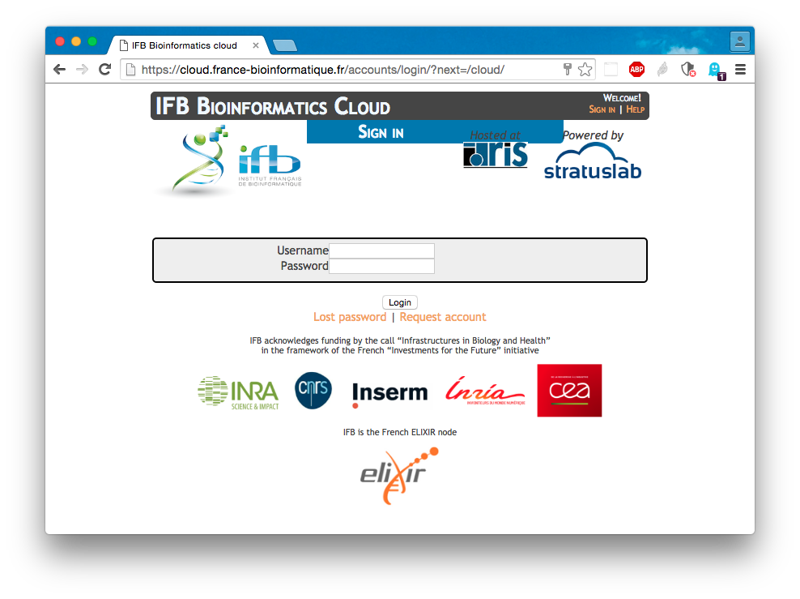

2. Cliquez sur le bouton ***New Instance***. 

3. In the dialog box, select the appliance **RSAT (2016-06)**, fill the **Name** field (for example type *RSAT-VM**) and click **Run**. 

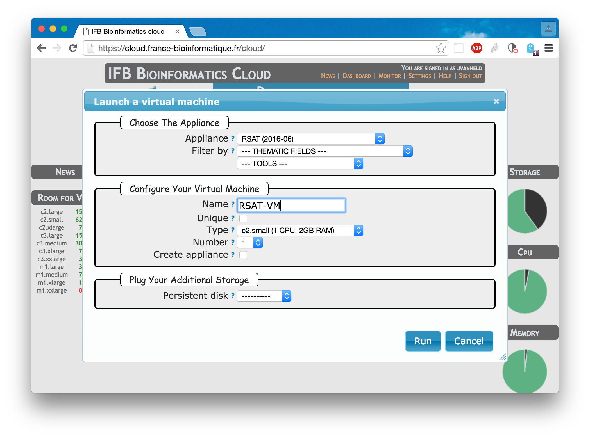

4. Th new instance will take a couple of minutes to start. Click periodically on **Show Instances** until your new instance appears with a green light, and the *ssh* and *http* links are active. 

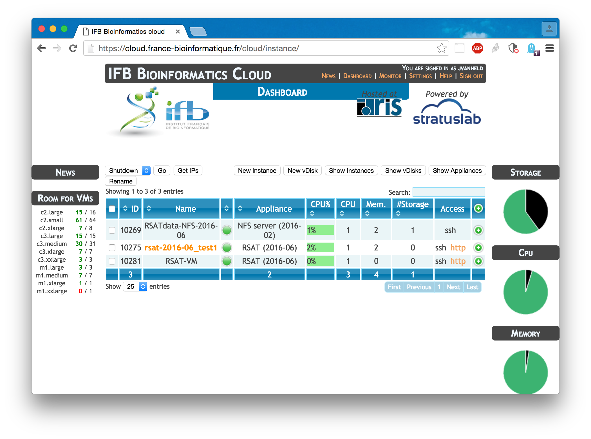

5. Click then on the **http** link for the RSAT-VM instance. This brings you to the home page of your own RSAT server. 

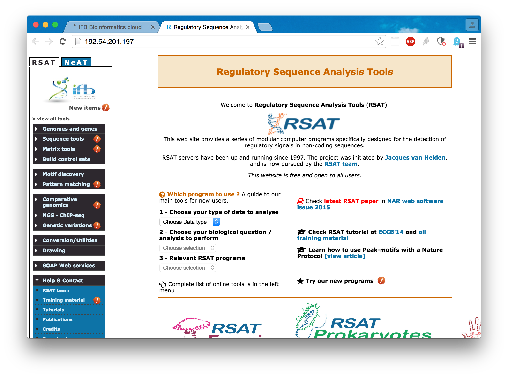

# A quick tour of the tools: from gene clusters to motifs

We will run a quick tour of some simple modular tools of the RSAT software suite. We will successively run the following analyses: 

1. Get the list of supported organisms.
2. Select a group of yeast genes involved in a common biological process (methionine metabolism and transport), which are supposedly co-regulated by some transcription factors. 
3. Retrieve the non-coding sequences located upstream of these genes. These upstream sequences contain the gene promoter and the cis-regulatory elements. 
4. Apply an *ab initio* motif discovery approach based on the detection of over-represented k)mers (*oligo-analysis*) in order to detect motifs potentially involved in the transcriptional response of these genes. 
5. Scan the promoter sequences to detect the sites (positions) matching the discovered motifs.
6. Generate a feature-map to inspect the position of these sites. 

## Protocol

### 1. Supported organisms

In the left panel, expland the menu **Genomes and genes** and click on the tool **Supported organisms**. 

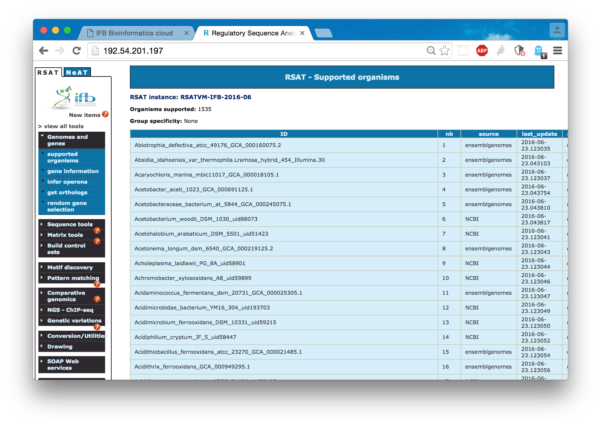

### 2. Getting genes by name

We will now gather the genes involved in methionine metabolism and transport. In the yeast Saccharomyces cerevisiae, these genes are generally named with a prefix MET, followed by one or several numbers.  

a. Under **Genes and genomes**, click **Gene information**. 
b. In the **Organism** menu, select the species *Saccharomyces cerevisiae*.
c. In the **Query** box, enter 'MET/d+'. This is a regular expression specifying that the gene name should contain the string MET followed by one or several digits (\d). 
d. Click **GO**.
    
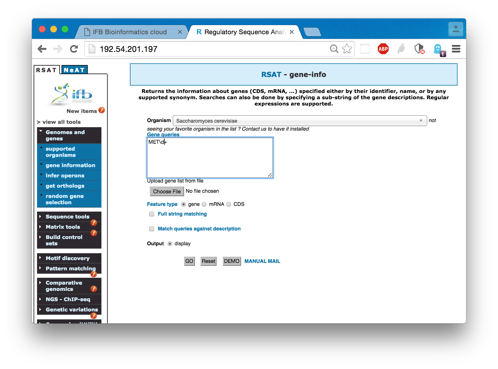

After a few seconds, the result form should appear, a table with the genes whose name matched the query, followed by a table of links to the result files, and another table **Next Step** of possible tools for the next step of the analysis. 

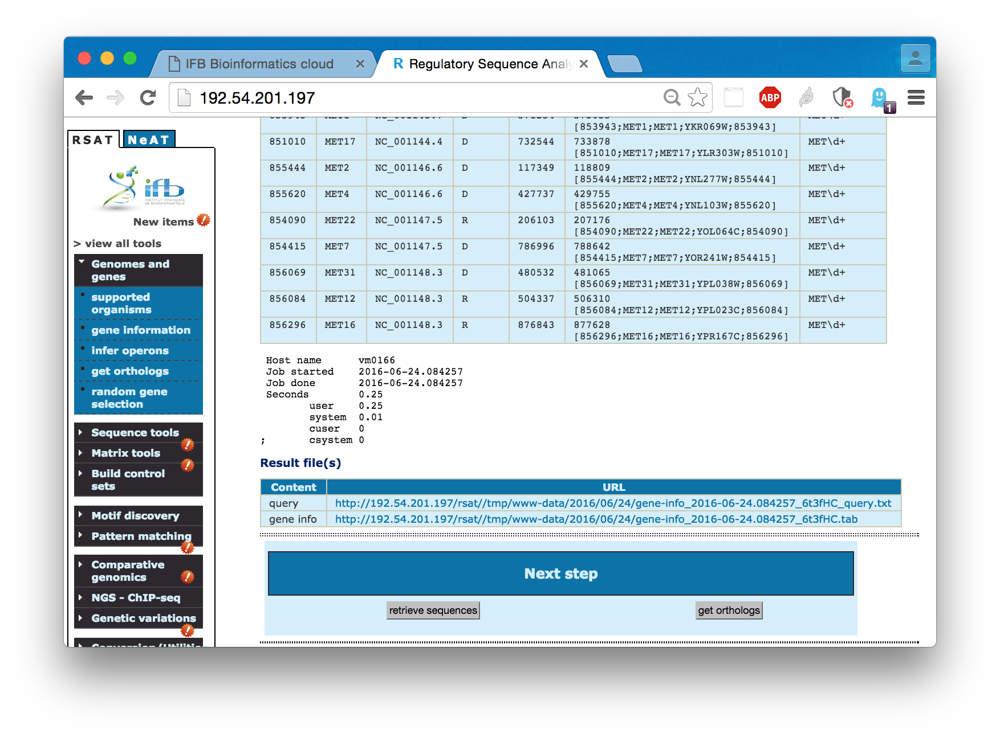

### 3. Retrieving upstream sequences

a. In the **Next step** table of the gene-info result, click on the button **retrieve sequence**. The **Retrieve sequence** form is displayed, where the organism and gene query box have automatically been filled with the results of your gene-info query. 

b. Leave all other parameteres unchanged and click **GO**. After a few seconds, the result page is displayed. 

c. Optionally, in the table **Result files**, click on the link tot the sequence file (fasta), to inspect the result.

d. Come back to the retrieve-seq result page. In the **Next step** table which appears at the bottom of this result page, click on the button **oligo-analysis**. 

### 4. Discovering over-represented k-mers in promoter sequences

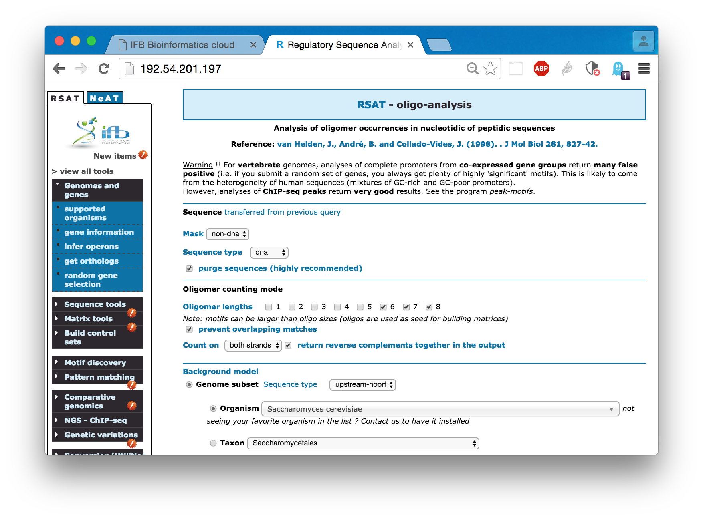

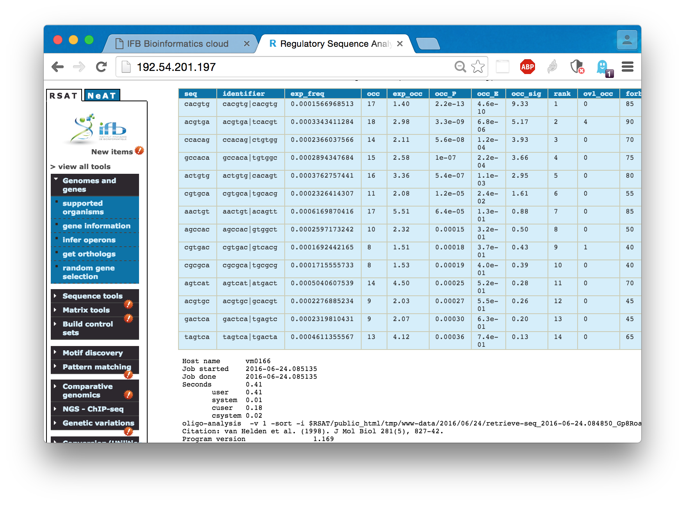

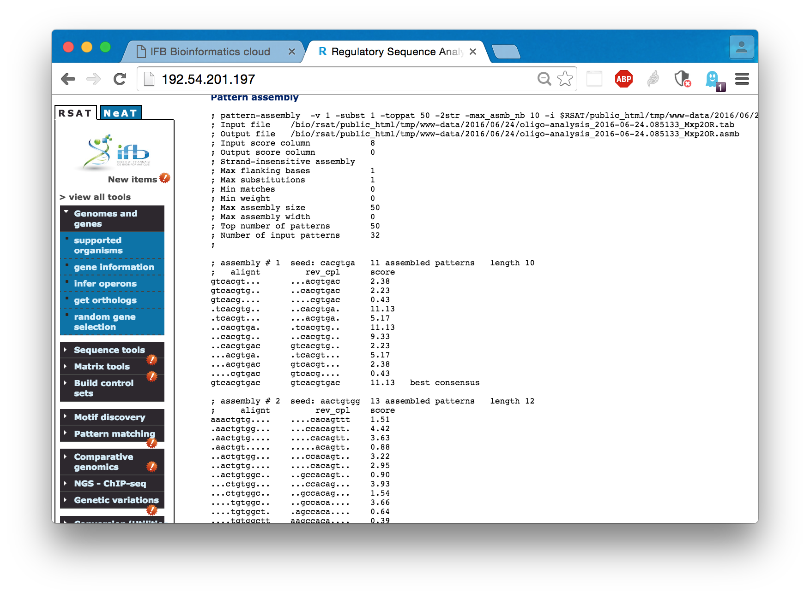

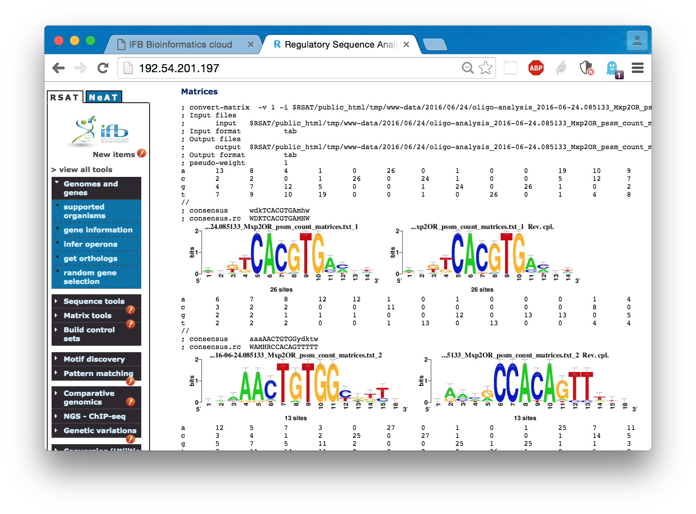

### 5. Predicting binding sites in promoter sequences

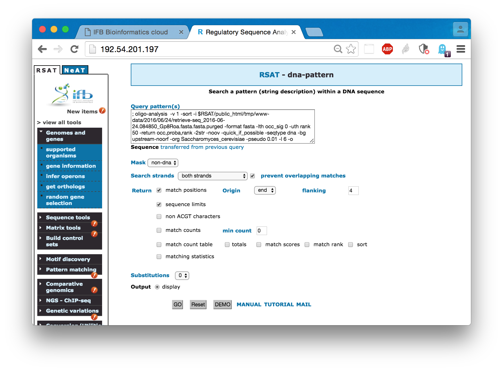

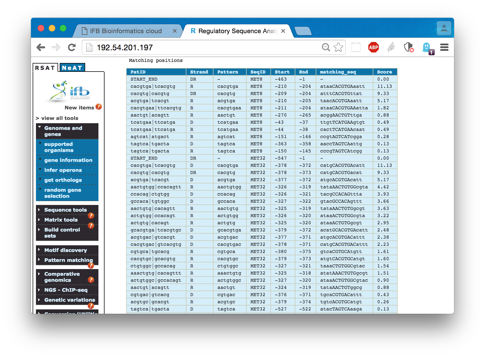

### 6. Displaying the predicted binding sites

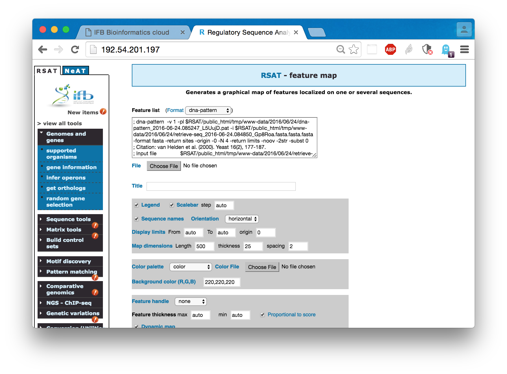

<!---->