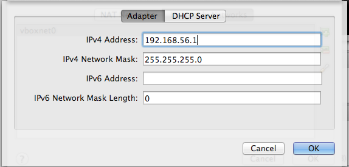

## Introduction

This documents contains instructions to download, install, configure and use a stand-alone instance of the Regulatory Sequence Analysis Tools (RSAT) in the form of a Virtual Machine (VM) running under [VirtualBox](https://www.virtualbox.org/).

## Requirements

The RSAT Virtual Machine (RSAT-VM) requires

1. The [VirtualBox platform](https://www.virtualbox.org/wiki/Downloads) should be installed on th host computer. This software runs under Linux, Solarix, Mac OSX and Windows operating systems.

2. A  sufficient amount of memory (RAM) to allocate two Gb to the RSAT-VM.

3. The VM initially occupies ~5Gb of hard disk space. By default, its hard drive is configured to grow dynamically when needed (for example when installing genomes), wih a maximal size of 18Gb.

## Technical specifications

- *RSAT-VM version* : rsat-vm-2015-02
- *Linux distribution*: [ubuntu-14.04.1-desktop-amd64](http://releases.ubuntu.com/14.04.1/ubuntu-14.04.1-desktop-amd64.iso)

## Downloading RSAT-VM

The Virtual Machine is available at ... (to be defined)

## Configuration

The RSAT-VM is provided in a ready-to-use mode.  However, you may need to adapt the configuration of your VirtualBox environment in order to obtain a correct behaviour of the VM.

###  VirtualBox host-only adapter

1. Open the VirtualBox program.

1. Open VirtualBox Preferences.
 Click on the Network option.
 Click on the tab Host-only Networks. Check if a host-only adapter is already installed. If not, create a new one by clicking the **+** icon on the right side (<a href="images/vb_prefs_host-only_network.png">snapshot</a>). 
	
1. Double-click on the host-only adapter to change its parameters.

1. In the Adaptor tab, set the parameters as follows (<a href="images/vb_prefs_host-only_adaptor.png">snapshot</a>).	 
	    1. IPv4 Address: 192.168.56.1
	    1. IPv4 Network Mask: 255.255.255.0
	    1. IPv6 Address: (leave this field blank)
	    1. IPv5 Nework Mask length: 0
	   
	

1. In the tab DHCP Server, set the parameters as follows (<a href="images/vb_prefs_host-only_dhcp.png">snapshot</a>).
	    1. Check the option Enable Server
	    1. Server Address: 192.168.56.100
	    1. Server mask: 255.255.255.0
	    1. Lower Address Bound: 192.168.56.101
	    1. Upper Address Bound: 192.168.56.154
	 

### Network settings for the guest machine

VirtualBox supports various ways to connect the guest (virtual machine) to the network.

#### Host-only network

This solution offers a good tradeoff between security and confort: your virtual machine (the guest) will be accessible only from your computer (the host).

1. In the panel showing the available virtual machines, right-click on the RSAT-VM (rsat-vb-ub14d), open the Settings ... dialog box.

1. In the tab Network, select Adapter 1, check Enable Network Adapter, select Attached to: **Host-only Adapter** (<a href="images/vm_settings_network_host-only.png">snapshot</a>).

1. In the pop-up menu besides the option Name, select vboxnet0.

#### NAT

**Note:** the host-only adapter will enable you to establish a connection (Web browsing, ssh connection) from the hosting operating system (the usual environment of your computer) to the guest system (the virtual machine). however, this adapter does not allow to connect the external world from the guest.

In parallel to the host-only adapter, we thus recommend to enable the second adapter and select NAT.

#### Bridged network

Alternatively , for the sake of flexibility, you might consider to use a bridged network. The bridged adapter is the most convenient, because it establishes a bidirectional connection between your VM (the guest) and the network. Your guest RSAT Web server can thus be used from any other computer in your network. This configuration can typically be usd to make an RSAT server available for all people from the same lab or institute.

 **Attention!**  The bridged network makes your virtual
	machine visible for all the other computers of the local
	network the host machine (your PC). Check with your system
	administrator that this fits the local security
	requirements.

1. In the panel showing the available virtual machines, right-click on the RSAT-VM (rsat-vb-ub14d), open the Settings ... dialog box.
1. In the tab Network, select Adapter 1, check Enable Network Adapter, select Attached to: Bridge   adapter.
1. In the pop-up menu besides the option Name, select an adapter depending on your local network configuration, e.g. Wi-fi (Airport) (<a href="images/vm_settings_network_bridged.png">snapshot</a>).
	    
	

## Running RSAT-VM

### Starting the RSAT virtual machine

1. In the left panel of VirtualBox, select the  virual machine (rsat-vb-ub14d), and click on   the Start icon.
 

At this stage, your RSAT VM should now be ready to be used from the Web interface. Assuming that you activated the host-only network as described abve, and that you only started one virtual machine), VirtualBox hould have assigned the first IP address of the range defined in the settings above: 192.168.56.101.

### Using RSAT-VM as Web server

1.  Open a connection to **<a target="_blank"
					href="http://192.168.56.101/">http://192.168.56.101/</a>**   in your web browser.
	 

If the link does not work, it probably means that your network was not activated as described above. You will then need to obtain the IP address of your VM. Unfortunately, VirtualBox does not provide a direct way to know which IP address has been assigned to a VM. The only way we found to get this information is to <a href="#rsat-vm_login">log in in the VM</a>, open a terminal, and run the command /sbin/ifconfig.

### RSAT-VM log-in

You can log with the following parameters:

1. Username: vmuser
1. Password: tochng
 

We intently chose an overly simple temporary password to ensure compatibility with AZERTY as well as QUERTY keyboards, but we recommend to use a safer password.

 
1. At your first login, you will be prompted to change your password before anything else.

1. The user vmuser is sudoer. After login, you can thus become the master of your Virtual Machine, create new users, install packages, etc.
 

### Chosing the adequate keyboard for your computer

A small difficulty when distributing a VM is the large variety of keybords expected to be found on the users' computers. By default, we selected the standard British QWERTY keyboard.

On Ubuntu 14.04 server version, keybord configuration can be
  modified with following command.

<pre class="brush:bash;">
  sudo dpkg-reconfigure console-data
</pre>

For the desktop version, click on the Settings icon , then on the <a href="images/text-entry_options.png">, and check the keyboard.</a>.

### Connecting RSAT-VM in ssh

<pre class="brush:bash;">
	ssh vmuser@192.168.56.101
</pre>

