\

### **Program description**

`network-interactions` is a tool that constructs Gene Regulatory Networks based on pattern-matching (the output of `matrix-scan` ) from a list of genes and transcription factors (TFs) of interest, it outputs the **Complete Network** (i.e. the network with all the genes and TFs), the **Only-TFs Network** (where the network is reduced to have only TFs as nodes), and **Indirect Interactions** (which tells you all the direct interactions of three nodes).

When given an input network, `network-interactions` also compares it with the **Complete Network**, thereby outlining the interactions that were present in both networks, and the interactions that were only found in one network. This can be used with intentions of method integration, interaction filtering, method comparison, etc. It is of particular interest when two different methods for network reconstruction give results in common, for those particular results are assumed to be more robust and thereby, more reliable.

**Keywords:**

* pattern-matching : pattern matching is the act of checking a given sequence of tokens for the presence of the constituents of some pattern, in this case, the pattern are the representations of the binding sites of transcription factors : motifs, and the sequences are DNA regulatory sequences.
* `matrix-scan` : is the RSAT program that searches for instances of one or several motifs in a given set of DNA sequences.
* Gene Regulatory Networks : are networks reconstructed from data, where the nodes are primarily genes or transcription factors (it differs between methods and interests) that approximate or suggest the real regulatory network underlying a given cellular or physiological process. 
* direct interaction : here, a direct interaction is one that connects two nodes of the network, where one is a TF and the other one is a gene or another TF. The interaction is said to be directed because there is evidence of putative physical interaction between the mandatory TF and the other gene, e.g. TFx -> geney, TFx regulates geney.
* indirect interaction : here, an interaction is said to be indirect if it takes two steps for a TF to regulate a gene. E.g. TFx -> TFy -> genez, here TFx indirectly regulates genez, but directly regulates TFy. Note that a TF can both directly and indirectly regulate the same gene.


\

### **Requisites**

##### **Transcription Factors List**

Here is an example of how the supplied list should look:

```
PAX2
FOXP2
YY1
```

***

##### **Regulatory Sequences BED File**

This file must indicate the genome coordinates (from a given genome assembly version, specified later) of the regulatory sequences of all the genes of your interest including TFs genes, e.g. the enhancer or the promoter coordinates.

The format should include the main three columns of a BED file; i.e. the chromosome, the start position of the coordinates and the ending position of the coordinates; as the fourth column, the name of the genes that are regulated by the elements on the specified coordinates should be indicated.

Here is an example of how the "Regulatory Sequences BED File" should look:

```
chr5	48408564	48409521	YY1
chr6	16647794	16648794	PAX2
chr6	16647794	16648794	PAX2
chr1	25506475	25507372	FOXP2
chr2	76546909	76547588	DNAH5
```

**Note:**

* TF genes' regulatory sequences where included.
* More than one regulatory sequence per gene can be specified.
* **The names of the TFs and their corresponding genes should match.**
* If no regulated gene is specified in the fourth column or 'NA' is written, then the specified coordinates in that row will not be taken into account by the program.

More information about the BED file format can be found [here](https://genome.ucsc.edu/FAQ/FAQformat.html#format1).

***

##### **Genome Assembly Version**

This is the genome version that is being referred in the coordinates above. **This genome version should be also available in the UCSC Genome Browser.**

The selected genome is the one you used as a reference in the bioinformatic analysis (the alignment of the reads to the genome reference) of your experiments, e.g. in an RNA-seq experiment.

You can check if the genome version you require is available in the form of this program, jump to section Fill the form > Mandatory Options > Step 4.

***

##### **Input Network**

You may also supply a previously done network (from any other program and by any other method) in case you want to compare or filter the output of this program and the one you used before. 

The format should have one gene-gene or TF-gene interaction per row, where the first one (probably) regulates the second one.

The input network should look like this (this example is only illustrative):

```
YY1 PAX2
PAX2 PAX2
FOXP2 DNAH5
```

\

### **Fill the form! : Step-by-step guide**

Go to <a href="../network-interactions_form.cgi" target='_parent'>`network-interactions`'s form</a> .

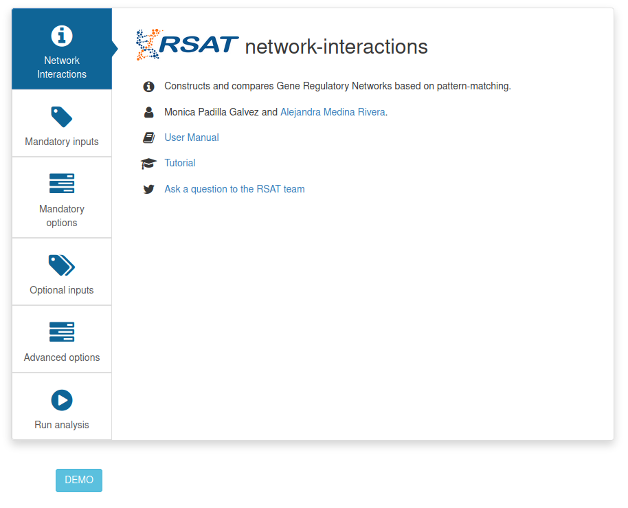

**Note:** The program wont run if the mandatory sections are not completely filled.

Click on the squares at the left to complete the form.

##### **Mandatory Input**

1. Provide an 'Analysis Title', this is used as the title for the results page.

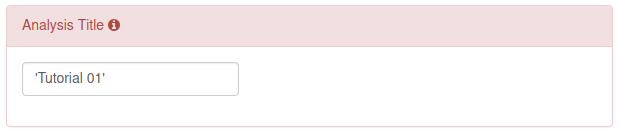

2. Supply the list of your Transcription Factors of interest as explained above (Requisites > Transcription Factors List). You may just type the names or upload a file with the button 'Browse...' below.

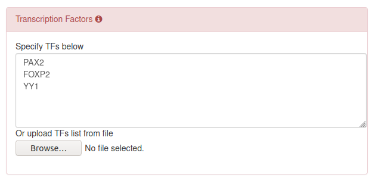

3. Supply the 'Regulatory Sequences BED file', you may paste the BED file or upload a file with the button 'Browse...' below. An example of the format is provided above (Requisites > Regulatory Sequences BED file).

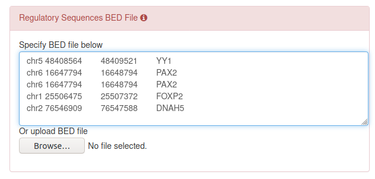

***

##### **Mandatory Options**

4. Click on 'UCSC genome' and check the available Genome Assemblies, select the one you used as reference in your experiments or referred to in the genome coordinates in the section above. 

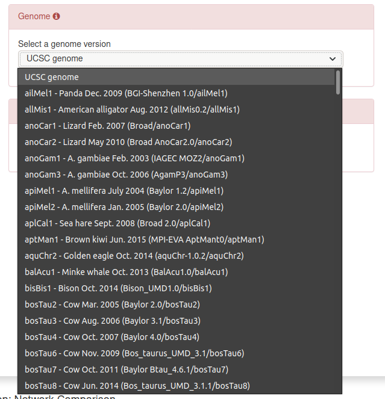

5. Provide a name for the folder, the folder will contain all the results and intermediate files of the current analysis.

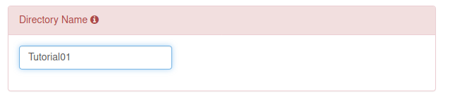

**Note:** You may stop filling the form at this point.

***

##### **Optional Inputs**

**Fill this section in case you want to compare an input network to the one made by this program. **

6. Supply the Input Network as specified above (Requisites > Input Network). You may paste the network or upload a file with the button 'Browse...' below.

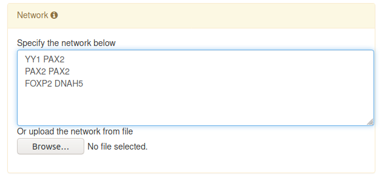

***

##### **Additional Options**

This program uses as default the following options:

* [JASPAR's 2020 nonredundant vertebrate collection](http://jaspar.genereg.net/downloads/) 

    [JASPAR](http://jaspar.genereg.net/) is a database of curated, non-redundant transcription factor binding profiles stored as position frequency matrices (PFMs) [1] or motifs, as referred to here. From this collection, `network-interactions` will choose the motifs that correspond to your transcription factors of interest. This motifs will be scanned through the regulatory sequences provided in order to find instances of putative physical interactions between the TFs of your interest and the genes in the network.

* a `matrix-scan score lower threshold` of `5` 

    Recall that `matrix-scan` is the program used to find instances of putative physical interactions between transcription factors and a given set of DNA sequences that this program uses internally. In order to keep only reliable TF-gene interactions, a default minimum score of 5 has been set. This score reduces the false-positves. 

**You may want to change these default options when:**

* Your organism of interest is not a vertebrate.
* You prefer using another motif database, which may contain motifs constructed with different types of data and different assumptions.
* You want to relax the threshold of putative TF-DNA interactions. In this case you should lower the score threshold. **Please note** that this may introduce (more) false positives to the results.
* You may want to restrict more the threshold of putative TF-DNA interactions. In this case you should increment the score threshold. For this purpose, you may also restrict the `pval upper threshold` lower.

**More notes and suggestions:**

* **In case you still want to use JASPAR, we suggest using a non-redundant collection**, since it lowers the computational time required to run the analysis and the results are less redundant and therefore easier to interpret.
* Previous JASPAR collections are not available.
* **We recommend using a p-value threshold of 0.00005** for mammalian data. 

7. In case you want to change the default database, just click on 'JASPAR 2020 nonredundant vertebrate' and select one of the available motif databases of your choice.

8. In case you want to change the `score lower threshold` just click on the section and change the number. 

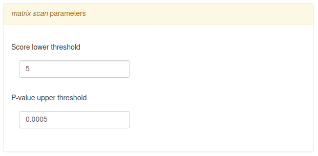

9. In case you want add the `p-val threshold` just click on the section and type the number. 

***

##### **Run Analysis**

If you want to see the result in the same page, you may leave the option 'server' and click 'GO'.

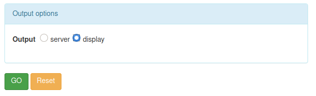

If you prefer to have the results sent to your mail via a link, select 'mail', type your mail and click 'GO'.

Click on the link.


\

### **DEMO**

For a DEMO of the program, just go the program form, click on 'DEMO' and click on 'GO'.


\

### **Results Page**

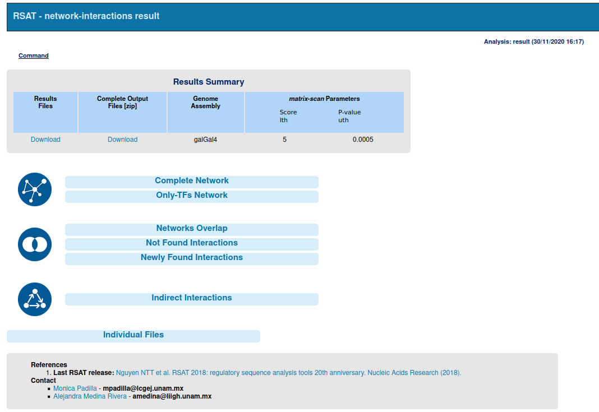

##### **Results Summary**

Here, you will find the folders to download with the Results files or the complete Ouput Files (that include intermediate files and the current summary results page), you can also see the `matrix-scan` options with which the program was run and the Genome Assembly Version used.

*** 

##### **Interactions Tables**

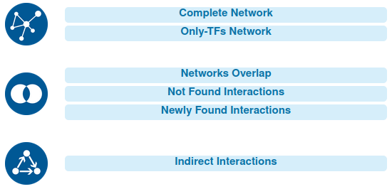

In this section, you can click on the different outputs to see the tables with information about the putative interactions that constitute the respective networks as well as the coordinates and the exact strand and position (counting from the start coordinate) where the interaction was found and the score `matrix-scan` assigned to such interaction. 

Some notes: 

* Multiple positions and scores can be specified if the interaction between the genes was found more than once in the same coordinates.
* In case something looks strange, please check the notes below of the tables for possible considerations to take into account.
* Search for your gene or TF or interest in 'Search' window above of each table!
* Rearrange the rows to display them in alphabetical order by clicking on the columns!

**Special Cases**

* The comparison tables will only appear when an input network was given.
* The Not Found Interactions will only provide the same information that was given in the input network, i.e. the two names of the interacting genes. No information about coordinates, positions or scores is given because such interactions where not found by `network-interactions`.
* **Indirect Interactions**
    + This table will contain first, the three nodes of the network, where TF1 indirectly regulates TF3. 
    + Then, the Interaction Details of each interaction of two. First TF1 with TF2 and then TF2 with TF3. The rest of the information is the same as in the other tables.

***

##### **Individual Files**

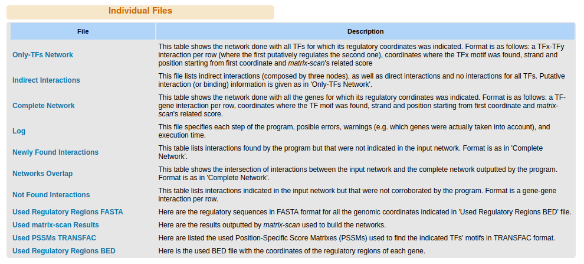

Click on the button to display each file generated by the program. Here you can see a short description of the contents of each file and you may click on each file name to download it. 

Please note that the html file that contains the current results page is not available, since its functionality is dependent upon many other files. In case you need it, you may download the 'Complete Output Files' zip folder.

\

### **Support and Contact**

For further assistance and issues, please contact us via mail:

- Mónica Padilla 
    mpadilla@lcgej.unam.mx
    
- Alejandra Medina
    amedina@liigh.unam.mx

\

### **References**

Nguyen, N. T. T., Contreras-Moreira, B., Castro-Mondragon, J. A., Santana-Garcia, W., Ossio, R., Robles-Espinoza, C. D., ... & van Helden, J. (2018). RSAT 2018: regulatory sequence analysis tools 20th anniversary. Nucleic acids research, 46(W1), W209-W214.

[1] Fornes, O., Castro-Mondragon, J. A., Khan, A., Van der Lee, R., Zhang, X., Richmond, P. A., ... & Santana-Garcia, W. (2020). JASPAR 2020: update of the open-access database of transcription factor binding profiles. Nucleic acids research, 48(D1), D87-D92.

\

_Last update: December 4th, 2020_


